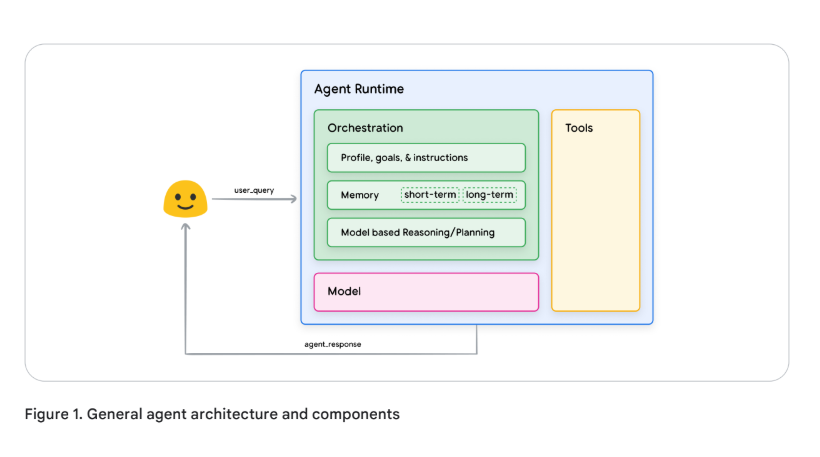
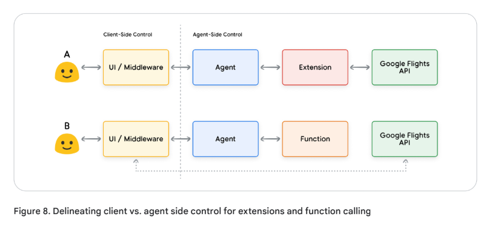

## Scope

The Google white paper on agents focuses on the specific types of agents that generative AI models are capable of building at the time of its publication.

https://drive.google.com/file/d/1oEjiRCTbd54aSdB_eEe3UShxLBWK9xkt/view

## Definition Of 'Agent'

The Google white paper on agents defines an agent as an application that attempts to achieve a goal by observing the world and acting upon it using the tools that it has at its disposal.

The Google white paper draws a line between agents versus models.

Models are limited to what is available in their training data. Agents have access to external systems.

Agents have access to a chat history. This lets them add additional information to their context over time.

One slightly confusing difference that Google white paper draws between models and agents is that models have no native logic layer. It says that users can form prompts as questions or use reasoning frameworks like chain of thought and ReAct. I'm not sure how true this is these days with o1 and R1.

On the other hand, it says that agents have native cognitive architecture. Unsure precisely what they mean by this—whether they mean it's baked into the model itself or whether it's baked into the system that the model is a part of.

## Definition Of 'Tools'

The Google white paper defines tools as bridging the gap between the agent's internal capabilities and the external world.

## Orchestration Layer

The Google White Paper defines the orchestration layer as a cyclical process that governs how the agent takes in information.

Personally, I would call this the system. The model is but one part in a more complex system.

## RAG

The white paper also gives a simple introduction to RAG.

It describes the process where you index your content into a database using embeddings. Then your agent can retrieve the content.

It also folds this information into an example using ReAct.

## Importance of Reasoning And Logic Frameworks

The Google white paper describes ReAct chain of thought and tree of thoughts as reasoning and logic frameworks.

## Extensions vs Functions

The Google white paper defines three primary tool types: extensions, functions, and data stores.

### Extensions

The Google white paper defines extensions as a bridge between an agent and an API. You create an extension by teaching the agent how to use the API using examples, teaching the agent what parameters or arguments are needed to successfully call the API.

Google's white paper ships with a few different extensions that you can just plug and play into your agent. For example, they describe a code interpreter extension that you can run with Python.

For me, these extensions feel simply like GET requests. I'm not sure why Google has created a nomenclature for them - they don't feel like a distinct concept. They feel similar to Chip Huyen's idea of capability extension - where you extend the capability of LLM using tool calls.

### Functions

The next concept that the agent White Paper introduces are functions.

It says that functions are different from extensions. Extensions are called as part of the core loop of the agent running. Instead, functions are executed in a different environment from the agent.

It says that with functions, the logic and execution of calling the actual API endpoint is offloaded away from the agent and back to the client-side application.

There are several reasons you might do this:

- API calls might need to be made at another layer of the application's stack
- There might be authentication or security reasons that prevent the agent from calling an API directly
- You may want to do "human in the loop" review
- You might need additional data transformation logic
- The developer might want to iterate on the agent's development without deploying additional infrastructure, using existing API endpoints from the client side to reuse more existing code

So here's a final summary about extensions: the agent handles the tool execution. With functions, the client is responsible for handling the tool execution.

In other words, it's another way of getting structured outputs from the LLM. Except in this case, the LLM is describing something it wants to see happen and requires a result.

## Vertex AI

Google's white paper also sells their Vertex AI platform.

